

   

<h1 align="center">
Codigrate Themes for VS Code
</h1>

A carefully crafted collection of VS Code color themes inspired by nature and iconic cities around the world.
Each theme is designed with balance, readability, and long coding sessions in mind—blending distinctive atmospheres
with thoughtfully tuned syntax colors that make your editor feel both elegant and personal.
Whether you prefer calm, light environments or deep, immersive dark palettes,
these themes aim to make every line of code more comfortable to read and a little more inspiring to write.

## Getting Started

1. Open the **Extensions** view in VS Code (`Ctrl+Shift+X` / `Cmd+Shift+X`).
2. Search for **Codigrate** or the specific theme name.
3. Click **Install**, then open the **Color Theme** picker (`Ctrl+K Ctrl+T` / `Cmd+K Cmd+T`).
4. Select the Codigrate theme you just installed.

## Notes

- To switch back, open the Color Theme picker again and pick another theme.
- Theme appearance may vary slightly depending on your operating system, editor version, and installed language extensions.

## Nature

   

<h1 align="center">
Everest
</h1>

## Description

Inspired by the majestic heights and serene landscapes of Mount Everest, this light theme brings a crisp and calming
presence to VS Code. Soft icy tones and clean, airy surfaces evoke snow-covered peaks and clear mountain skies,
creating a coding experience that feels fresh, focused, and easy on the eyes.

## Screenshots

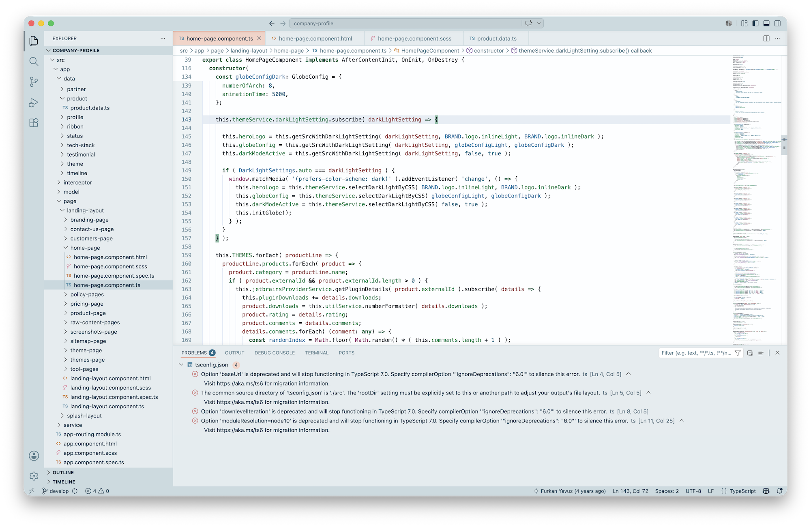

## Color Palette

<table>
   <tr>
      <td></td>
      <td>
         Editor Background
      </td>
      <td>
         <a href="https://codigrate.com/tools/color/FDFEFF">#FDFEFF</a>
      </td>
   </tr>
   <tr>
      <td></td>
      <td>
         Window Background
      </td>
      <td>
         <a href="https://codigrate.com/tools/color/E4ECEF">#E4ECEF</a>
      </td>
   </tr>
   <tr>
      <td></td>
      <td>
         Local Variables
      </td>
      <td>
         <a href="https://codigrate.com/tools/color/1A6D9F">#1A6D9F</a>
      </td>
   </tr>
   <tr>
      <td></td>
      <td>
         Strings and Numbers
      </td>
      <td>
         <a href="https://codigrate.com/tools/color/005E79">#005E79</a>
      </td>
   </tr>
   <tr>
      <td></td>
      <td>
         Instance Fields
      </td>
      <td>
         <a href="https://codigrate.com/tools/color/007A47">#007A47</a>
      </td>
   </tr>
   <tr>
      <td></td>
      <td>
         Keywords
      </td>
      <td>
         <a href="https://codigrate.com/tools/color/2E674F">#2E674F</a>
      </td>
   </tr>
   <tr>
      <td></td>
      <td>
         Static Fields
      </td>
      <td>
         <a href="https://codigrate.com/tools/color/83529B">#83529B</a>
      </td>
   </tr>
   <tr>
      <td></td>
      <td>
         Global Variables
      </td>
      <td>
         <a href="https://codigrate.com/tools/color/8C4069">#8C4069</a>
      </td>
   </tr>
   <tr>
      <td></td>
      <td>
         Active Border Colors
      </td>
      <td>
         <a href="https://codigrate.com/tools/color/ED7E5A">#ED7E5A</a>
      </td>
   </tr>
   <tr>
      <td></td>
      <td>
         Parameters
      </td>
      <td>
         <a href="https://codigrate.com/tools/color/8F4446">#8F4446</a>
      </td>
   </tr>
</table>

---

   

<h1 align="center">
Aurora Borealis
</h1>

## Description

Inspired by the natural phenomena of the Aurora Borealis, this dark theme captures the majesty and mystery of the Arctic
night sky. Deep blue-green tones shape the editor surface, while luminous accents echo the ethereal colors of the Northern
Lights, creating a coding atmosphere that feels immersive, calm, and vibrant.

## Screenshots

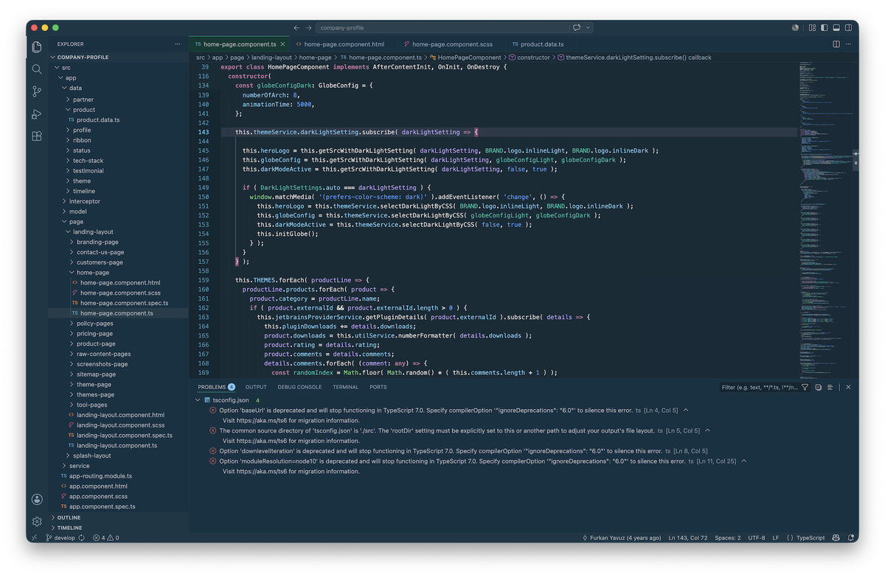

## Color Palette

<table>
   <tr>
      <td></td>
      <td>
         Editor Background
      </td>
      <td>
         <a href="https://codigrate.com/tools/color/142B37">#142B37</a>
      </td>
   </tr>
   <tr>
      <td></td>
      <td>
         Window Background
      </td>
      <td>
         <a href="https://codigrate.com/tools/color/183240">#183240</a>
      </td>
   </tr>
   <tr>
      <td></td>
      <td>
         Strings and Numbers
      </td>
      <td>
         <a href="https://codigrate.com/tools/color/549EFF">#549EFF</a>
      </td>
   </tr>
   <tr>
      <td></td>
      <td>
         Instance Fields
      </td>
      <td>
         <a href="https://codigrate.com/tools/color/7ACEF5">#7ACEF5</a>
      </td>
   </tr>
   <tr>
      <td></td>
      <td>
         Tab Colors
      </td>
      <td>
         <a href="https://codigrate.com/tools/color/043A33">#043A33</a>
      </td>
   </tr>
   <tr>
      <td></td>
      <td>
         Global Variables
      </td>
      <td>
         <a href="https://codigrate.com/tools/color/73D379">#73D379</a>
      </td>
   </tr>
   <tr>
      <td></td>
      <td>
         Local Variables
      </td>
      <td>
         <a href="https://codigrate.com/tools/color/05C0A6">#05C0A6</a>
      </td>
   </tr>
   <tr>
      <td></td>
      <td>
         Keywords
      </td>
      <td>
         <a href="https://codigrate.com/tools/color/BB719B">#BB719B</a>
      </td>
   </tr>
   <tr>
      <td></td>
      <td>
         Static Fields
      </td>
      <td>
         <a href="https://codigrate.com/tools/color/D193BB">#D193BB</a>
      </td>
   </tr>
   <tr>
      <td></td>
      <td>
         Parameters
      </td>
      <td>
         <a href="https://codigrate.com/tools/color/BAA5FF">#BAA5FF</a>
      </td>
   </tr>
</table>

---

   

<h1 align="center">
Sakura
</h1>

## Description

Inspired by the enchanting softness of Sakura blossoms, this theme brings a delicate spring atmosphere to VS Code.
Gentle pinks and muted complementary tones create a serene, polished editor experience that feels light, graceful,
and easy to live with throughout the day.

## Screenshots

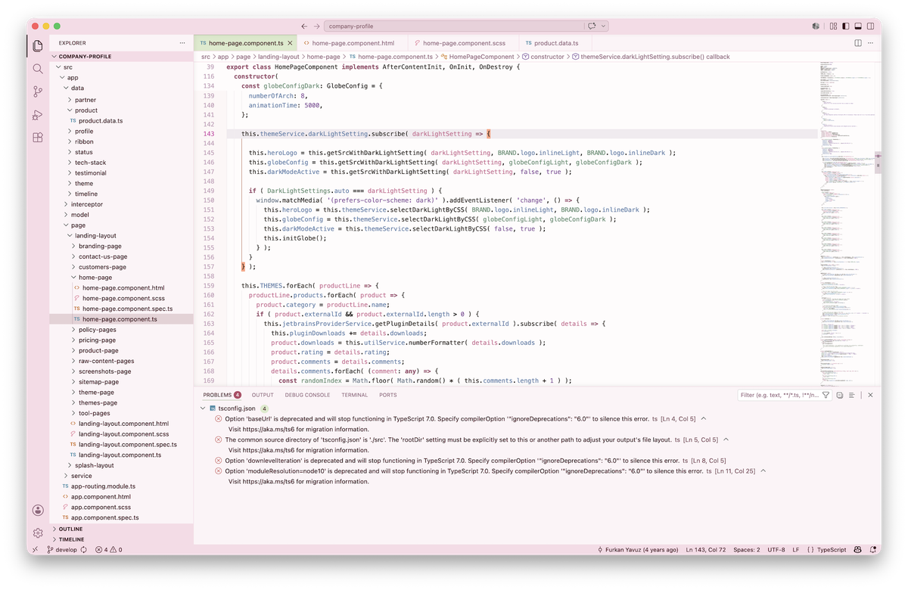

## Color Palette

<table>
   <tr>
      <td></td>
      <td>
         Editor Background
      </td>
      <td>
         <a href="https://codigrate.com/tools/color/FEFCFC">#FEFCFC</a>
      </td>
   </tr>
   <tr>
      <td></td>
      <td>
         Surface Background
      </td>
      <td>
         <a href="https://codigrate.com/tools/color/F8DBE6">#F8DBE6</a>
      </td>
   </tr>
   <tr>
      <td></td>
      <td>
         Selection Background
      </td>
      <td>
         <a href="https://codigrate.com/tools/color/FFC9DC">#FFC9DC</a>
      </td>
   </tr>
   <tr>
      <td></td>
      <td>
         Parameters
      </td>
      <td>
         <a href="https://codigrate.com/tools/color/CB6B91">#CB6B91</a>
      </td>
   </tr>
   <tr>
      <td></td>
      <td>
         Keywords
      </td>
      <td>
         <a href="https://codigrate.com/tools/color/98556C">#98556C</a>
      </td>
   </tr>
   <tr>
      <td></td>
      <td>
         Active Background
      </td>
      <td>
         <a href="https://codigrate.com/tools/color/DBEACB">#DBEACB</a>
      </td>
   </tr>
   <tr>
      <td></td>
      <td>
         Local Variables
      </td>
      <td>
         <a href="https://codigrate.com/tools/color/618C71">#618C71</a>
      </td>
   </tr>
   <tr>
      <td></td>
      <td>
         Static Fields
      </td>
      <td>
         <a href="https://codigrate.com/tools/color/69A2BD">#69A2BD</a>
      </td>
   </tr>
   <tr>
      <td></td>
      <td>
         Instance Fields
      </td>
      <td>
         <a href="https://codigrate.com/tools/color/607FA9">#607FA9</a>
      </td>
   </tr>
   <tr>
      <td></td>
      <td>
         Global Variables
      </td>
      <td>
         <a href="https://codigrate.com/tools/color/687788">#687788</a>
      </td>
   </tr>
</table>

---

   

<h1 align="center">
Sequoia
</h1>

## Description

Inspired by the towering presence and grounded calm of sequoias, this dark theme surrounds VS Code with rich woodland
tones and subtle green life. It creates a focused, earthy atmosphere that feels steady, deep, and comfortably subdued.

## Screenshots

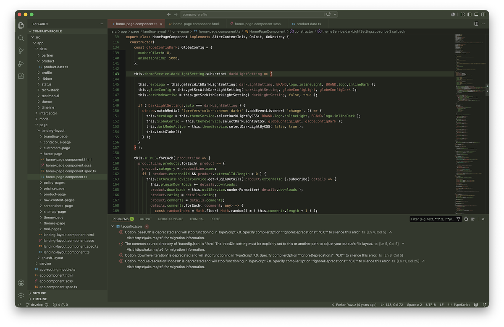

## Color Palette

<table>
   <tr>
      <td></td>
      <td>
         Editor Background
      </td>
      <td>
         <a href="https://codigrate.com/tools/color/20231C">#20231C</a>
      </td>
   </tr>
   <tr>
      <td></td>
      <td>
         Window Background
      </td>
      <td>
         <a href="https://codigrate.com/tools/color/32382C">#32382C</a>
      </td>
   </tr>
   <tr>
      <td></td>
      <td>
         Selection Background
      </td>
      <td>
         <a href="https://codigrate.com/tools/color/405133">#405133</a>
      </td>
   </tr>
   <tr>
      <td></td>
      <td>
         Instance Fields
      </td>
      <td>
         <a href="https://codigrate.com/tools/color/6E9F56">#6E9F56</a>
      </td>
   </tr>
   <tr>
      <td></td>
      <td>
         Static Fields
      </td>
      <td>
         <a href="https://codigrate.com/tools/color/369772">#369772</a>
      </td>
   </tr>
   <tr>
      <td></td>
      <td>
         Strings
      </td>
      <td>
         <a href="https://codigrate.com/tools/color/A68F59">#A68F59</a>
      </td>
   </tr>
   <tr>
      <td></td>
      <td>
         Keywords
      </td>
      <td>
         <a href="https://codigrate.com/tools/color/A67B5B">#A67B5B</a>
      </td>
   </tr>
   <tr>
      <td></td>
      <td>
         Local Variables
      </td>
      <td>
         <a href="https://codigrate.com/tools/color/A86255">#A86255</a>
      </td>
   </tr>
   <tr>
      <td></td>
      <td>
         Parameters
      </td>
      <td>
         <a href="https://codigrate.com/tools/color/986969">#986969</a>
      </td>
   </tr>
   <tr>
      <td></td>
      <td>
         Comments
      </td>
      <td>
         <a href="https://codigrate.com/tools/color/6C625A">#6C625A</a>
      </td>
   </tr>
</table>

---

   

<h1 align="center">
Autumn
</h1>

## Description

Inspired by the warm hues and rustic charm of autumn, this light theme brings soft seasonal comfort to VS Code.
Earthy oranges, mellow neutrals, and crisp contrast create a cozy editor space that feels welcoming, balanced,
and quietly expressive.

## Screenshots

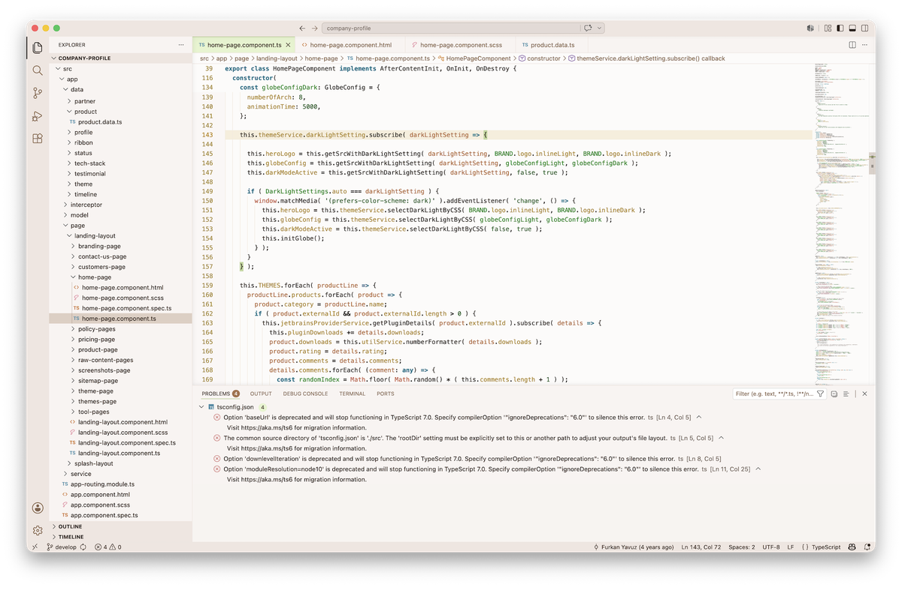

## Color Palette

<table>
   <tr>
      <td></td>
      <td>
         Window Background
      </td>
      <td>
         <a href="https://codigrate.com/tools/color/F8F4F1">#F8F4F1</a>
      </td>
   </tr>
   <tr>
      <td></td>
      <td>
         Selection Background
      </td>
      <td>
         <a href="https://codigrate.com/tools/color/F4D3BD">#F4D3BD</a>
      </td>
   </tr>
   <tr>
      <td></td>
      <td>
         Global Variables
      </td>
      <td>
         <a href="https://codigrate.com/tools/color/BE553E">#BE553E</a>
      </td>
   </tr>
   <tr>
      <td></td>
      <td>
         Metadata
      </td>
      <td>
         <a href="https://codigrate.com/tools/color/773918">#773918</a>
      </td>
   </tr>
   <tr>
      <td></td>
      <td>
         Parameters
      </td>
      <td>
         <a href="https://codigrate.com/tools/color/B0633A">#B0633A</a>
      </td>
   </tr>
   <tr>
      <td></td>
      <td>
         Instance Fields
      </td>
      <td>
         <a href="https://codigrate.com/tools/color/A87F25">#A87F25</a>
      </td>
   </tr>
   <tr>
      <td></td>
      <td>
         Secondary Accent
      </td>
      <td>
         <a href="https://codigrate.com/tools/color/DEA51D">#DEA51D</a>
      </td>
   </tr>
   <tr>
      <td></td>
      <td>
         Strings and Numbers
      </td>
      <td>
         <a href="https://codigrate.com/tools/color/1B591E">#1B591E</a>
      </td>
   </tr>
   <tr>
      <td></td>
      <td>
         Local Variables
      </td>
      <td>
         <a href="https://codigrate.com/tools/color/0E8113">#0E8113</a>
      </td>
   </tr>
   <tr>
      <td></td>
      <td>
         Keywords
      </td>
      <td>
         <a href="https://codigrate.com/tools/color/006E83">#006E83</a>
      </td>
   </tr>
</table>

---

   

<h1 align="center">
Roraima
</h1>

## Description

Inspired by the dramatic sunset over Mount Roraima, this dark theme blends dusky purples, ember-like oranges,
and twilight shadows into a bold yet balanced editor palette. It brings warmth, depth, and a cinematic sense
of atmosphere to everyday coding.

## Screenshots

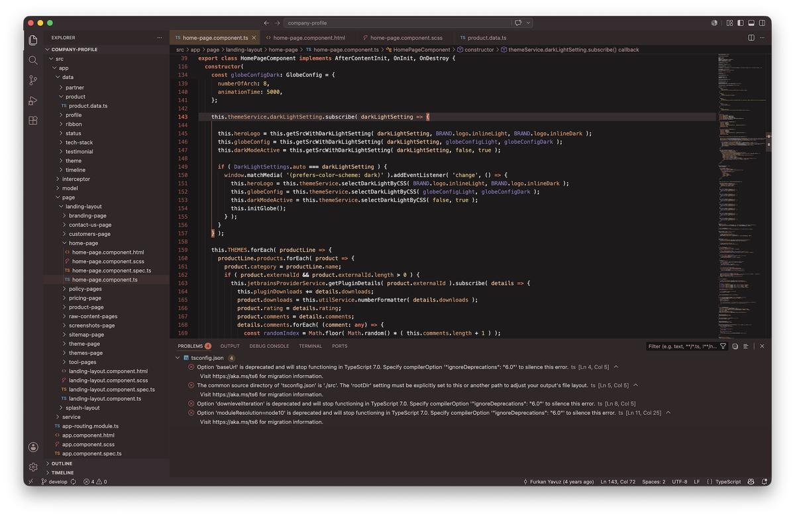

## Color Palette

<table>
   <tr>
      <td></td>
      <td>
         Editor Background
      </td>
      <td>
         <a href="https://codigrate.com/tools/color/1E1A1B">#1E1A1B</a>
      </td>
   </tr>
   <tr>
      <td></td>
      <td>
         Window Background
      </td>
      <td>
         <a href="https://codigrate.com/tools/color/322628">#322628</a>
      </td>
   </tr>
   <tr>
      <td></td>
      <td>
         Selection Background
      </td>
      <td>
         <a href="https://codigrate.com/tools/color/5A261E">#5A261E</a>
      </td>
   </tr>
   <tr>
      <td></td>
      <td>
         Keywords
      </td>
      <td>
         <a href="https://codigrate.com/tools/color/D17458">#D17458</a>
      </td>
   </tr>
   <tr>
      <td></td>
      <td>
         Instance Fields
      </td>
      <td>
         <a href="https://codigrate.com/tools/color/D69568">#D69568</a>
      </td>
   </tr>
   <tr>
      <td></td>
      <td>
         Metadata
      </td>
      <td>
         <a href="https://codigrate.com/tools/color/D1BA46">#D1BA46</a>
      </td>
   </tr>
   <tr>
      <td></td>
      <td>
         Strings
      </td>
      <td>
         <a href="https://codigrate.com/tools/color/DDBE6D">#DDBE6D</a>
      </td>
   </tr>
   <tr>
      <td></td>
      <td>
         Static Fields
      </td>
      <td>
         <a href="https://codigrate.com/tools/color/ED8B8B">#ED8B8B</a>
      </td>
   </tr>
   <tr>
      <td></td>
      <td>
         Local Variables
      </td>
      <td>
         <a href="https://codigrate.com/tools/color/8F78B7">#8F78B7</a>
      </td>
   </tr>
   <tr>
      <td></td>
      <td>
         Tag Name
      </td>
      <td>
         <a href="https://codigrate.com/tools/color/7E6AA3">#7E6AA3</a>
      </td>
   </tr>
</table>

## Cities

   

<h1 align="center">
Istanbul
</h1>

## Description

Inspired by the soft daylight and sea breezes of Istanbul, this theme brings airy turquoise tones and warm historical
accents into VS Code. It feels fresh, calm, and expressive, offering a refined editor atmosphere with a distinct coastal elegance.

## Screenshots

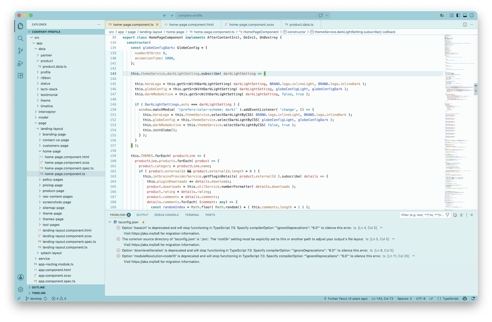

## Color Palette

<table>
   <tr>
      <td></td>
      <td>
         Editor Background
      </td>
      <td>
         <a href="https://codigrate.com/tools/color/FAFDFD">#FAFDFD</a>
      </td>
   </tr>
   <tr>
      <td></td>
      <td>
         Window Background
      </td>
      <td>
         <a href="https://codigrate.com/tools/color/DBF0F1">#DBF0F1</a>
      </td>
   </tr>
   <tr>
      <td></td>
      <td>
         Selection Background
      </td>
      <td>
         <a href="https://codigrate.com/tools/color/A3DDE5">#A3DDE5</a>
      </td>
   </tr>
   <tr>
      <td></td>
      <td>
         Keywords
      </td>
      <td>
         <a href="https://codigrate.com/tools/color/1190A1">#1190A1</a>
      </td>
   </tr>
   <tr>
      <td></td>
      <td>
         Strings
      </td>
      <td>
         <a href="https://codigrate.com/tools/color/0887B5">#0887B5</a>
      </td>
   </tr>
   <tr>
      <td></td>
      <td>
         Active Background
      </td>
      <td>
         <a href="https://codigrate.com/tools/color/EFEAD0">#EFEAD0</a>
      </td>
   </tr>
   <tr>
      <td></td>
      <td>
         Attributes
      </td>
      <td>
         <a href="https://codigrate.com/tools/color/B87958">#B87958</a>
      </td>
   </tr>
   <tr>
      <td></td>
      <td>
         Parameters
      </td>
      <td>
         <a href="https://codigrate.com/tools/color/B8514D">#B8514D</a>
      </td>
   </tr>
   <tr>
      <td></td>
      <td>
         Tags
      </td>
      <td>
         <a href="https://codigrate.com/tools/color/C16979">#C16979</a>
      </td>
   </tr>
   <tr>
      <td></td>
      <td>
         Metadata
      </td>
      <td>
         <a href="https://codigrate.com/tools/color/9C6E7C">#9C6E7C</a>
      </td>
   </tr>
</table>

---

   

<h1 align="center">
Miami
</h1>

## Description

Inspired by the electric nights and pastel sunsets of Miami, this dark theme fills VS Code with bold purples,
vivid pinks, tropical teals, and warm neon energy. It creates a playful yet polished editor experience with
strong personality and clear visual contrast.

## Screenshots

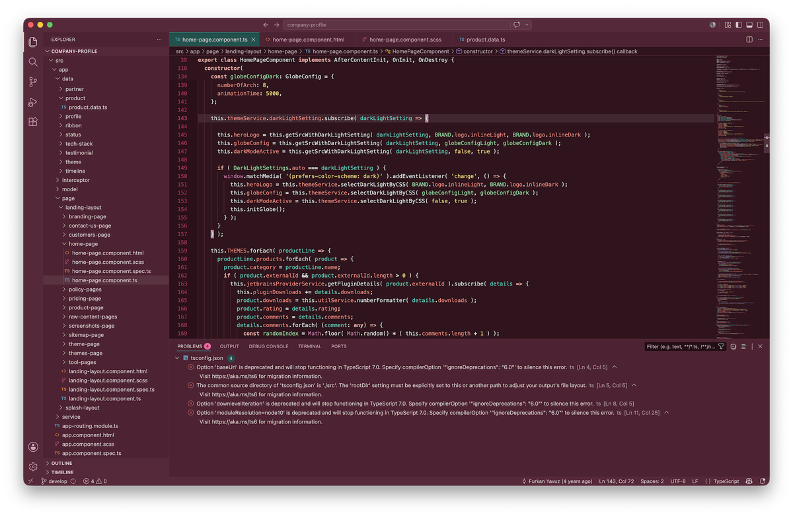

## Color Palette

<table>
   <tr>
      <td></td>
      <td>
         Editor Background
      </td>
      <td>
         <a href="https://codigrate.com/tools/color/33121D">#33121D</a>
      </td>
   </tr>
   <tr>
      <td></td>
      <td>
         Window Background
      </td>
      <td>
         <a href="https://codigrate.com/tools/color/532033">#532033</a>
      </td>
   </tr>
   <tr>
      <td></td>
      <td>
         Accent Color
      </td>
      <td>
         <a href="https://codigrate.com/tools/color/FF5FA2">#FF5FA2</a>
      </td>
   </tr>
   <tr>
      <td></td>
      <td>
         Tag Colors
      </td>
      <td>
         <a href="https://codigrate.com/tools/color/FE788C">#FE788C</a>
      </td>
   </tr>
   <tr>
      <td></td>
      <td>
         Instance Fields
      </td>
      <td>
         <a href="https://codigrate.com/tools/color/FE8078">#FE8078</a>
      </td>
   </tr>
   <tr>
      <td></td>
      <td>
         Keywords
      </td>
      <td>
         <a href="https://codigrate.com/tools/color/F2A4A0">#F2A4A0</a>
      </td>
   </tr>
   <tr>
      <td></td>
      <td>
         Static Fields
      </td>
      <td>
         <a href="https://codigrate.com/tools/color/92B5E8">#92B5E8</a>
      </td>
   </tr>
   <tr>
      <td></td>
      <td>
         Parameters
      </td>
      <td>
         <a href="https://codigrate.com/tools/color/00D1C1">#00D1C1</a>
      </td>
   </tr>
   <tr>
      <td></td>
      <td>
         Variables
      </td>
      <td>
         <a href="https://codigrate.com/tools/color/82D59F">#82D59F</a>
      </td>
   </tr>
   <tr>
      <td></td>
      <td>
         Strings
      </td>
      <td>
         <a href="https://codigrate.com/tools/color/F8D273">#F8D273</a>
      </td>
   </tr>
</table>

---

   

<h1 align="center">
Rio de Janeiro
</h1>

## Description

Inspired by Rio's lush hills, bright air, and coastal energy, this theme blends soft minty tones with vibrant greens
and clean blues to create a light, refreshing VS Code experience that feels lively, open, and balanced.

## Screenshots

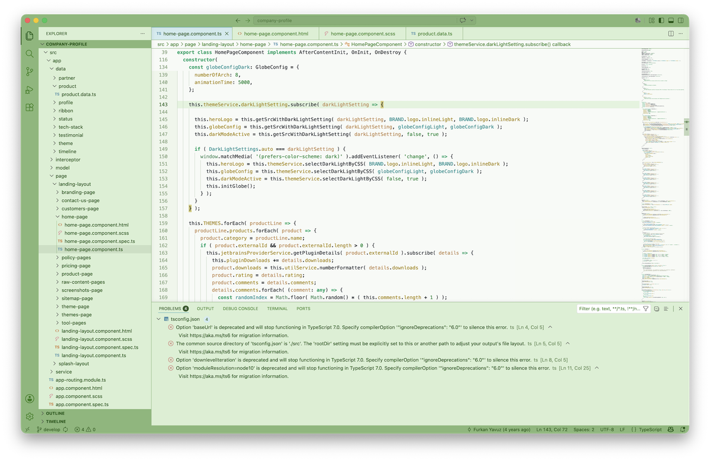

## Color Palette

<table>
   <tr>
      <td></td>
      <td>
         Editor Background
      </td>
      <td>
         <a href="https://codigrate.com/tools/color/F7FAF6">#F7FAF6</a>
      </td>
   </tr>
   <tr>
      <td></td>
      <td>
         Window Background
      </td>
      <td>
         <a href="https://codigrate.com/tools/color/D9EFD2">#D9EFD2</a>
      </td>
   </tr>
   <tr>
      <td></td>
      <td>
         Surface Background
      </td>
      <td>
         <a href="https://codigrate.com/tools/color/85B778">#85B778</a>
      </td>
   </tr>
   <tr>
      <td></td>
      <td>
         Keywords
      </td>
      <td>
         <a href="https://codigrate.com/tools/color/13A166">#13A166</a>
      </td>
   </tr>
   <tr>
      <td></td>
      <td>
         Strings
      </td>
      <td>
         <a href="https://codigrate.com/tools/color/028134">#028134</a>
      </td>
   </tr>
   <tr>
      <td></td>
      <td>
         Secondary Accent
      </td>
      <td>
         <a href="https://codigrate.com/tools/color/2287D5">#2287D5</a>
      </td>
   </tr>
   <tr>
      <td></td>
      <td>
         Static Fields
      </td>
      <td>
         <a href="https://codigrate.com/tools/color/0A80B3">#0A80B3</a>
      </td>
   </tr>
   <tr>
      <td></td>
      <td>
         Tags
      </td>
      <td>
         <a href="https://codigrate.com/tools/color/1065B8">#1065B8</a>
      </td>
   </tr>
   <tr>
      <td></td>
      <td>
         Instance Fields
      </td>
      <td>
         <a href="https://codigrate.com/tools/color/A3860A">#A3860A</a>
      </td>
   </tr>
   <tr>
      <td></td>
      <td>
         Search Match
      </td>
      <td>
         <a href="https://codigrate.com/tools/color/ECDA61">#ECDA61</a>
      </td>
   </tr>
</table>

---

   

<h1 align="center">
Paris
</h1>

## Description

Inspired by candlelit cafes, stone boulevards, and Paris's late-night glow, this theme brings dusky rose,
plum-espresso depth, and soft blush accents into VS Code. It feels romantic, moody, and elegant without losing clarity.

## Screenshots

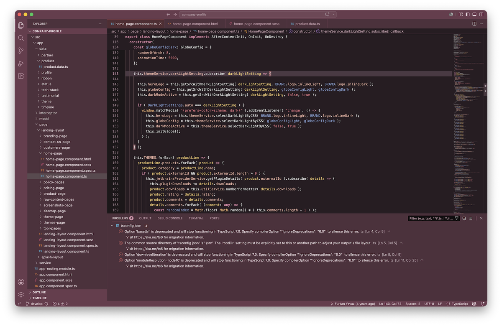

## Color Palette

<table>
   <tr>
      <td></td>
      <td>
         Editor Background
      </td>
      <td>
         <a href="https://codigrate.com/tools/color/281D22">#281D22</a>
      </td>
   </tr>
   <tr>
      <td></td>
      <td>
         Window Background
      </td>
      <td>
         <a href="https://codigrate.com/tools/color/4F303C">#4F303C</a>
      </td>
   </tr>
   <tr>
      <td></td>
      <td>
         Surface Background
      </td>
      <td>
         <a href="https://codigrate.com/tools/color/6A3C4D">#6A3C4D</a>
      </td>
   </tr>
   <tr>
      <td></td>
      <td>
         Keywords
      </td>
      <td>
         <a href="https://codigrate.com/tools/color/D584A3">#D584A3</a>
      </td>
   </tr>
   <tr>
      <td></td>
      <td>
         Strings
      </td>
      <td>
         <a href="https://codigrate.com/tools/color/DF7583">#DF7583</a>
      </td>
   </tr>
   <tr>
      <td></td>
      <td>
         Instance Fields
      </td>
      <td>
         <a href="https://codigrate.com/tools/color/F3B7A9">#F3B7A9</a>
      </td>
   </tr>
   <tr>
      <td></td>
      <td>
         Global Variables
      </td>
      <td>
         <a href="https://codigrate.com/tools/color/FBBA77">#FBBA77</a>
      </td>
   </tr>
   <tr>
      <td></td>
      <td>
         Parameters
      </td>
      <td>
         <a href="https://codigrate.com/tools/color/F1C970">#F1C970</a>
      </td>
   </tr>
   <tr>
      <td></td>
      <td>
         Secondary Accent
      </td>
      <td>
         <a href="https://codigrate.com/tools/color/5E7BB3">#5E7BB3</a>
      </td>
   </tr>
   <tr>
      <td></td>
      <td>
         Local Variables
      </td>
      <td>
         <a href="https://codigrate.com/tools/color/87A1D3">#87A1D3</a>
      </td>
   </tr>
</table>

---

   

<h1 align="center">
Tallinn
</h1>

## Description

Inspired by Tallinn's crisp light and Baltic calm, this theme pairs cool porcelain tones with Nordic blues for an editor
experience that feels clean, minimal, and quietly elegant. Subtle contrast keeps everything fresh and readable.

## Screenshots

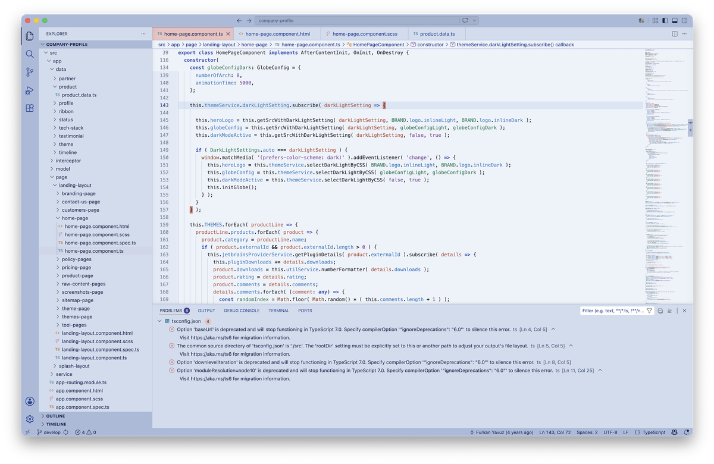

## Color Palette

<table>
   <tr>
      <td></td>
      <td>
         Editor Background
      </td>
      <td>
         <a href="https://codigrate.com/tools/color/EDF2FA">#EDF2FA</a>
      </td>
   </tr>
   <tr>
      <td></td>
      <td>
         Window Background
      </td>
      <td>
         <a href="https://codigrate.com/tools/color/D0DCEF">#D0DCEF</a>
      </td>
   </tr>
   <tr>
      <td></td>
      <td>
         Instance Fields
      </td>
      <td>
         <a href="https://codigrate.com/tools/color/377CC1">#377CC1</a>
      </td>
   </tr>
   <tr>
      <td></td>
      <td>
         Keywords
      </td>
      <td>
         <a href="https://codigrate.com/tools/color/425EB8">#425EB8</a>
      </td>
   </tr>
   <tr>
      <td></td>
      <td>
         Accent Color
      </td>
      <td>
         <a href="https://codigrate.com/tools/color/324979">#324979</a>
      </td>
   </tr>
   <tr>
      <td></td>
      <td>
         Strings
      </td>
      <td>
         <a href="https://codigrate.com/tools/color/81549C">#81549C</a>
      </td>
   </tr>
   <tr>
      <td></td>
      <td>
         Parameters
      </td>
      <td>
         <a href="https://codigrate.com/tools/color/B6564B">#B6564B</a>
      </td>
   </tr>
   <tr>
      <td></td>
      <td>
         Tag Colors
      </td>
      <td>
         <a href="https://codigrate.com/tools/color/B1544B">#B1544B</a>
      </td>
   </tr>
   <tr>
      <td></td>
      <td>
         Static Fields
      </td>
      <td>
         <a href="https://codigrate.com/tools/color/548A64">#548A64</a>
      </td>
   </tr>
   <tr>
      <td></td>
      <td>
         Local Variables
      </td>
      <td>
         <a href="https://codigrate.com/tools/color/1E7857">#1E7857</a>
      </td>
   </tr>
</table>

---

   

<h1 align="center">
Tokyo
</h1>

## Description

Inspired by Tokyo's neon-lit streets and midnight skyline, this theme surrounds VS Code with deep indigo tones,
electric violets, and cool luminous accents. It feels sleek, atmospheric, and distinctly futuristic while staying polished.

## Screenshots

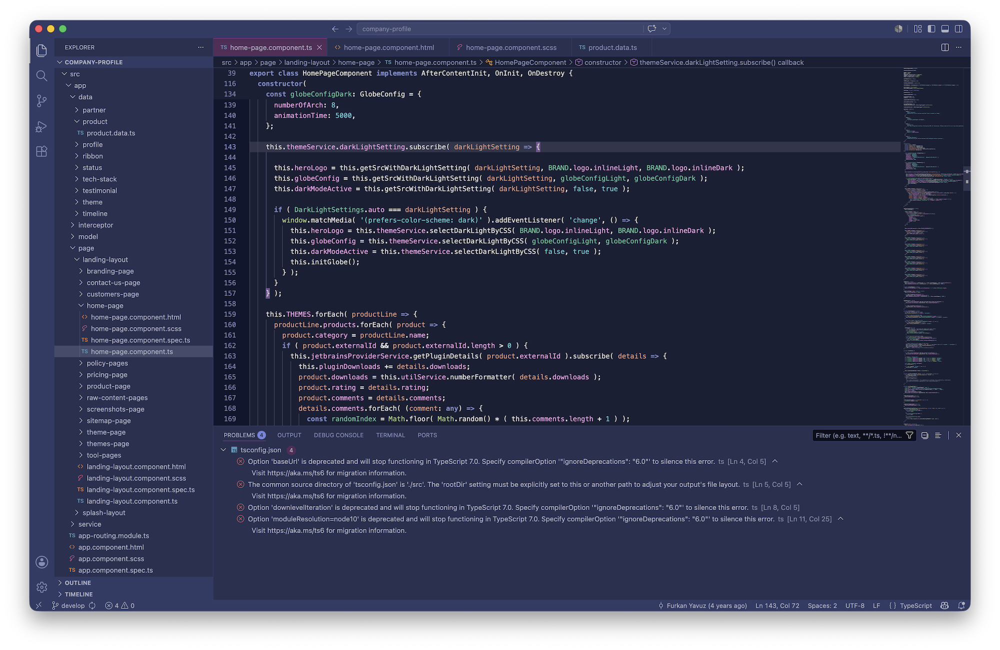

## Color Palette

<table>
   <tr>
      <td></td>
      <td>
         Editor Background
      </td>
      <td>
         <a href="https://codigrate.com/tools/color/1A1F35">#1A1F35</a>
      </td>
   </tr>
   <tr>
      <td></td>
      <td>
         Window Background
      </td>
      <td>
         <a href="https://codigrate.com/tools/color/2A3051">#2A3051</a>
      </td>
   </tr>
   <tr>
      <td></td>
      <td>
         Keywords
      </td>
      <td>
         <a href="https://codigrate.com/tools/color/7B89C8">#7B89C8</a>
      </td>
   </tr>
   <tr>
      <td></td>
      <td>
         Tag Colors
      </td>
      <td>
         <a href="https://codigrate.com/tools/color/7FA0DD">#7FA0DD</a>
      </td>
   </tr>
   <tr>
      <td></td>
      <td>
         Accent Color
      </td>
      <td>
         <a href="https://codigrate.com/tools/color/7285DC">#7285DC</a>
      </td>
   </tr>
   <tr>
      <td></td>
      <td>
         Instance Fields
      </td>
      <td>
         <a href="https://codigrate.com/tools/color/ECA1EB">#ECA1EB</a>
      </td>
   </tr>
   <tr>
      <td></td>
      <td>
         Static Fields
      </td>
      <td>
         <a href="https://codigrate.com/tools/color/D3B690">#D3B690</a>
      </td>
   </tr>
   <tr>
      <td></td>
      <td>
         Parameters
      </td>
      <td>
         <a href="https://codigrate.com/tools/color/DD9B7F">#DD9B7F</a>
      </td>
   </tr>
   <tr>
      <td></td>
      <td>
         Variables
      </td>
      <td>
         <a href="https://codigrate.com/tools/color/5CC19D">#5CC19D</a>
      </td>
   </tr>
   <tr>
      <td></td>
      <td>
         Strings
      </td>
      <td>
         <a href="https://codigrate.com/tools/color/5DC8D6">#5DC8D6</a>
      </td>
   </tr>
</table>

## Contributors

<!-- ALL-CONTRIBUTORS-LIST:START - Do not remove or modify this section -->
<!-- prettier-ignore-start -->
<!-- markdownlint-disable -->
<table>
   <tr>
      <td align="center"><a href="https://github.com/furknyavuz"> <b>Furkan Yavuz</b></a> </td>
      <td align="center"><a href="https://github.com/kerimalp"> <b>Kerim Alp Kaya</b></a> </td>
   </tr>
</table>
<!-- markdownlint-enable -->
<!-- prettier-ignore-end -->
<!-- ALL-CONTRIBUTORS-LIST:END -->

## LICENSE

The source code for this project is released under the [MIT License](LICENSE).

 

<table align="right">
   <tr>
      <td></td>
      <td><b>Codigrate © 2026</b></td>
   </tr>
</table>
